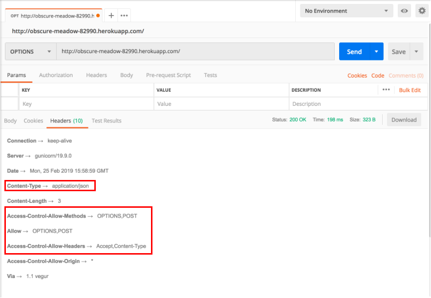
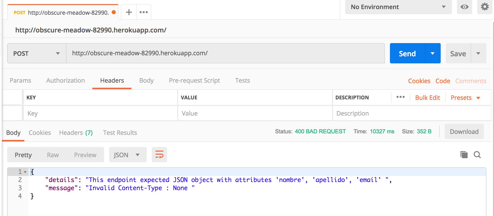
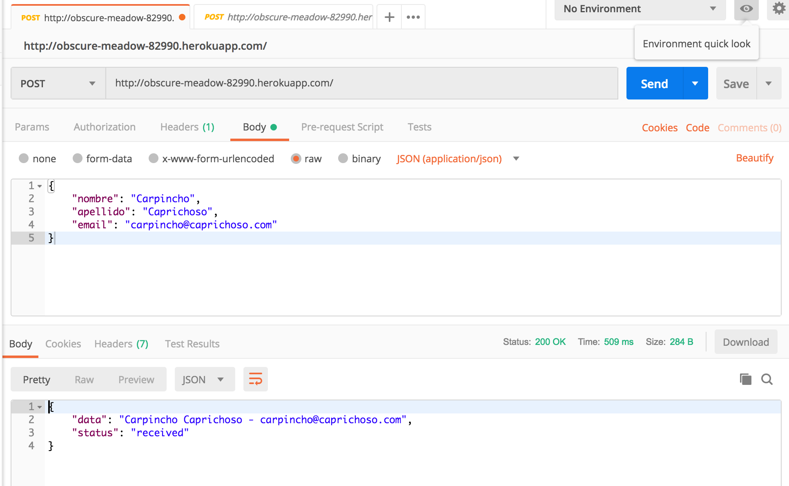

# Buscando el método HTTP

A partir de los métodos HTTP vistos en la clase, analizar el siguiente URL [http://obscure-meadow-82990.herokuapp.com](http://obscure-meadow-82990.herokuapp.com) y encontrar la manera de enviar sus datos

- `nombre`
- `apellido`
- `email`

Se advierte que el sitio **NO** soporta el método `GET`, por lo que un intento de abrir dicho URL en el navegador devolverá un error del tipo (405) `Method Not Allowed` 

Para completar el ejercicio, se puede utilizar cualquier herramienta con el que se sienta más familiarizado, como ser:

- Utilizar una herramienta de línea de comandos como `curl`.
- Utilizar un cliente REST gráfico como `insomnia` o `postman`. (Recomendado)
- Programar las peticiones necesarias en cualquier lenguaje de su preferencia.

Sirvase de volver a leer el [enlace de apoyo](https://github.com/diegocrzt/diegocrzt.github.io/tree/master/http_protocol).

Recuerde que descubrir el **método** y el **formato** en el que se esperan los datos (nombre,apellido,email) es parte del ejercicio. Observe cuidadosamente las respuestas y las cabeceras (*headers*) HTTP retornadas por el servidor, así como las cabeceras que usted esté enviando.

Una vez que envíe sus datos correctamente, el servidor guardará dichos datos para luego retornar una respuesta HTTP con código 200 `OK` y un mensaje similar al siguiente pero con los datos que usted haya enviado.

```json
{
  "data": "Nombre Apellido - direccion@email.com",
  "status": "received"
}
```

Se consideraran las peticiones hasta las **23:59** del día **domingo, 24 de febrero de 2019**. 

**Importante**: En ocaciones el servidor suele apagarse para ahorrar recursos, pero se despierta segundos después de recibir una petición. Si aparecen errores del tipo `Timeout`, simplemente reintente la petición.

# Solución

La solución al problema requería un análisis de las cabeceras y previa lectura del README propuesto. En ésta propuesta de solución uso postman, otras herramientas también podían haber sido utilizadas.

## Primer paso.
La mejor manera de empezar era enviar el request `OPTIONS`, porque con éste request íbamos a descubrir los métodos 
propuestos por el servidor.

Con éste request ya podíamos conocer todo lo requerido para la segunda petición, sin embargo, lo más importante era notar que los
headers `Allow` y `Access-Control-Allow-Methods` describían la lista de métodos aceptados, en nuestro caso `OPTIONS` y `POST`.


Si recordamos la definición de `POST`, ésto tiene total sentido, porque nosotros estamos buscando crear una nueva entidad 
en el servidor.

    POST: The POST method requests that the server accept the entity enclosed in the request as a new subordinate of the web resource identified by the URI.

## Segundo paso.
Una vez conocido el método requerido, lo que nos faltaba por descubrir era el formato y los campos que debíamos enviar.
 
Para descubrir el formato habría que fijarse en la primera petición que hicimos. El header `Access-Control-Allow-Headers` indicaba que el formato del servicio requiere especificar la cabecera `Content-type` y en ésta especificar el formato del cuerpo.

Para conocer el formato, se podría realizar una petición `POST` sin cuerpo y el servidor nos respondería con un error indicando que esperaba un objeto JSON. 

Por lo tanto, el valor del header `Content-type` debería ser **application/json**. 



En la imagen de arriba, podemos apreciar que la respuesta del servidor ya indica el nombre de los campos esperados. 

Con éstos datos podemos construir la petición correcta.


# Conclusión
_Lo interesante de éste ejercicio, no es sólo alcanzar a realizar la petición con los datos correctos, sino entender que 
todos los métodos y las cabeceras que transitan como meta-datos en una petición HTTP tienen un propósito. Éste 
intercambio es muchas veces transparente para nosotros, porque el navegador aplica la lógica por debajo._

**Si no hiciste el ejercicio, te sugiero que leas el README precedente con la bibliografía propuesta y trates de entender
la solución dado que en los trabajos futuros se dará por sabido lo que se desarrolló en ésta clase.**
